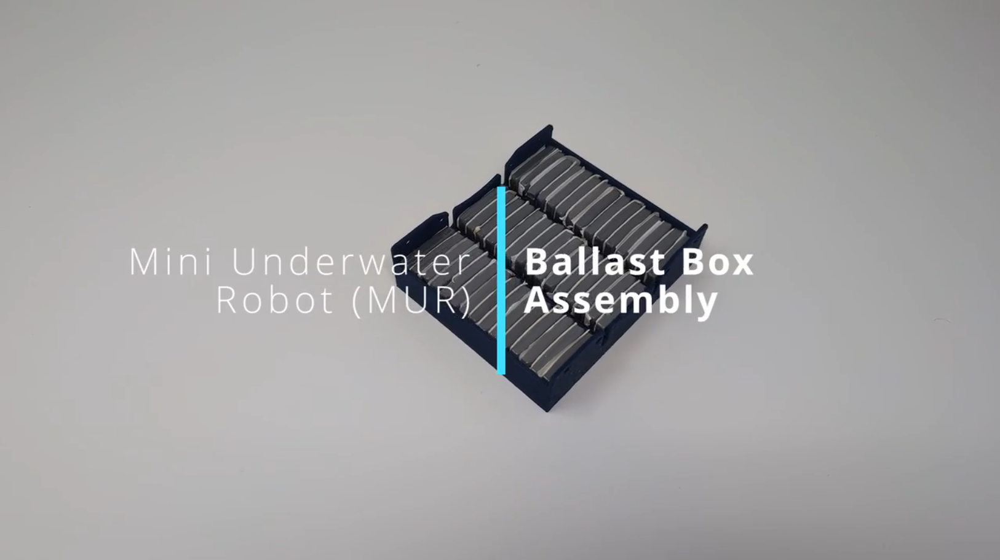
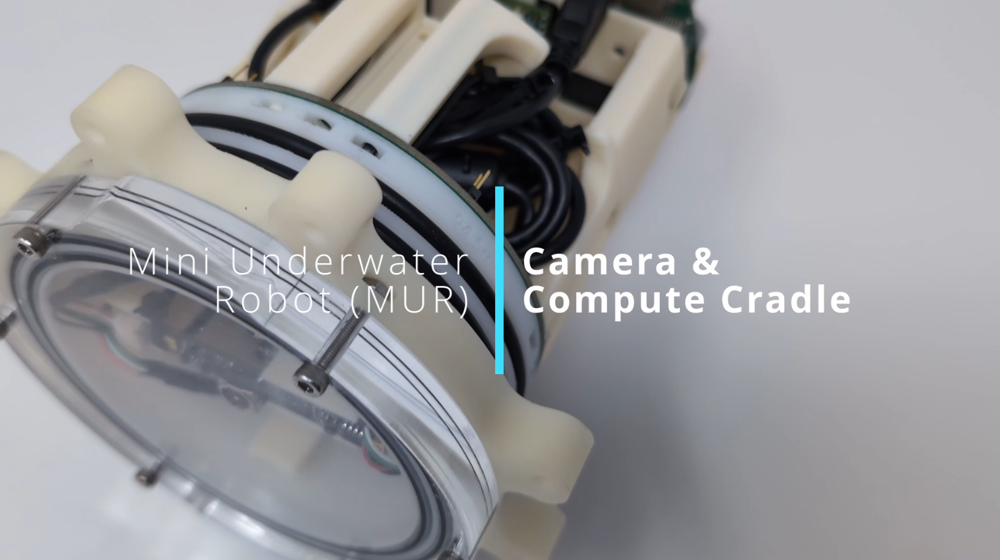
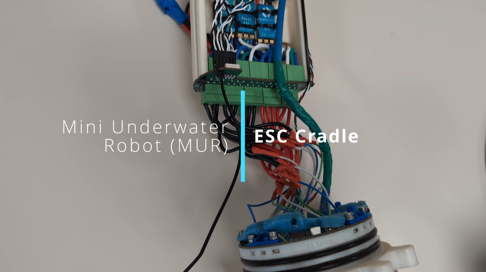
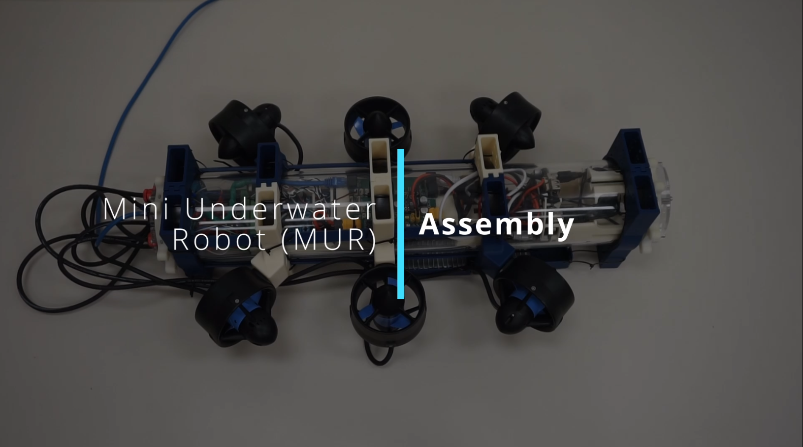
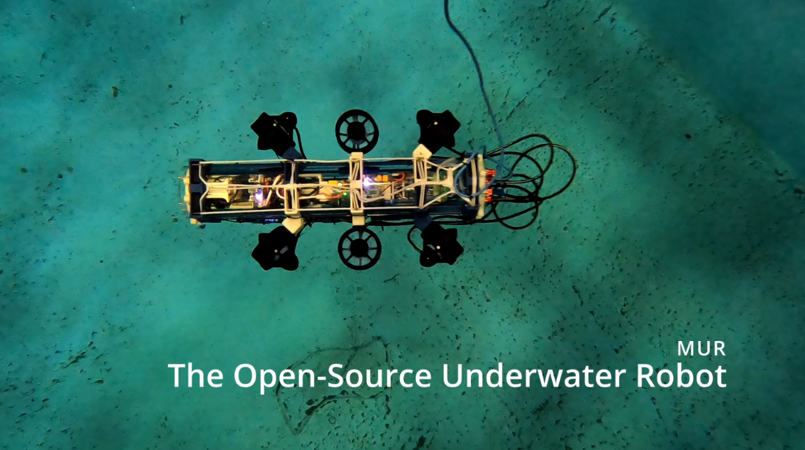
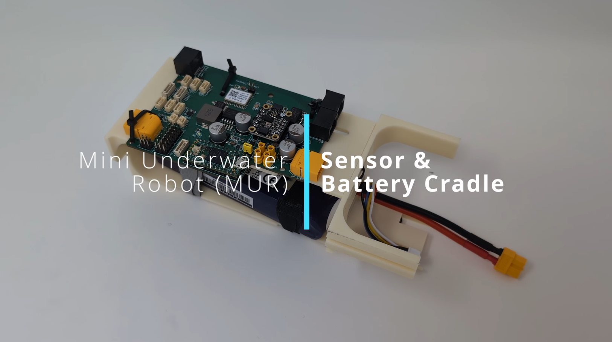
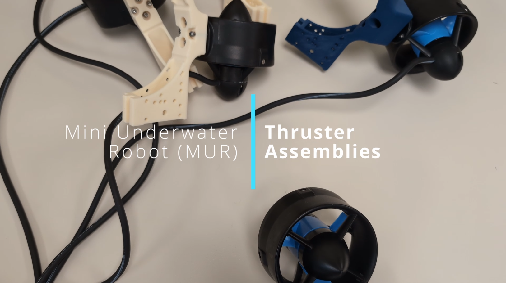

# MUR Assembly Guide

Welcome to the **MUR Assembly Guide**. This document provides clear, step-by-step instructions—with helpful video tutorials—for assembling the key components of the MUR system. The guide covers the following areas:

- **Thruster Assemblies**
- **Sensor and Battery Cradle Assembly**
- **Camera & Compute Cradle Assembly**
- **ESC Cradle Assembly**
- **Ballast Box Assembly**
- **Final Full Assembly**

Please follow each section carefully to ensure proper assembly and system functionality.

(the build instructions are mostly within the video. Please follow along for specific instructions.)

---

# Thruster Assemblies

## Steps to Assemble Thrusters

### 1. Attach Thrusters to Thruster Mounts
- Secure the thrusters to their designated mounts using **stainless steel bolts**.
- Tighten the bolts evenly to prevent misalignment.
- Avoid over-tightening to prevent thread damage.

### 2. Apply Rubber Seal for Friction Press
- Apply a **rubber seal** between the mount and the vehicle frame prior to final assembly.
- This creates a friction press fit, improving grip and minimizing vibration.
- Verify that the seal is properly aligned before proceeding.

---

# Sensor and Battery Cradle Assembly

## Steps to Assemble the Sensor and Battery Cradle

### 1. 3D Print the Required Assembly Parts
- Use the provided **CAD files** to print all necessary components.
- Ensure the parts are printed with proper infill and material strength.

### 2. Attach the PCB to the Top Bracket
- Secure the PCB to the top bracket using **zip ties**.
- Ensure it is firmly attached without excessive compression.

### 3. Secure the Battery to the Base
- Fasten the battery to the base with **reusable Velcro straps**.
- Confirm that the battery is stable and accessible for easy swaps.

### 4. Connect Required Cables
- Plug in the necessary **Ethernet, USB, power, and motor control cables**.
- Route the cables neatly to avoid strain or interference.

---

# Camera & Compute Cradle Assembly

## Steps to Assemble the Camera & Compute Cradle

### 1. 3D Print the Required Assembly Parts
- Print all necessary components using the provided **CAD files**.

### 2. Attach the PCB to the Back Piece
- Secure the PCB to the back piece with **zip ties**.
- Ensure a secure attachment without applying excessive pressure.

### 3. Install the Cameras
- Insert the cameras into their designated slots.
- Use **zip ties** to hold them securely in place.

### 4. Manage Cables
- Route cables carefully to avoid obstructing the camera’s view.
- Use cable ties or clips to keep wiring organized and secure.

### 5. Attach O-Rings and Face Plate
- Install the **O-rings** for a secure, watertight fit.
- Mount the face plate, ensuring proper alignment.

---

# ESC Cradle Assembly

## Steps to Assemble the ESC Cradle

### 1. 3D Print the Required Parts
- Print the ESC cradle components using the provided **CAD files**.
- Verify that the parts have sufficient strength to support the ESC.

### 2. Attach the PCB to the Front of the 3D Print
- Mount the PCB to the front of the 3D-printed structure using **zip ties**.
- Avoid excessive tension to prevent damage to the PCB.

### 3. Connect the ESC to Screw Terminals
- Carefully plug the ESC into its designated screw terminals.
- Double-check all connections to ensure a secure, proper fit.

### 4. Connect Thrusters to Matching Screw Terminals
- Attach each thruster’s wiring to its corresponding ESC screw terminal.
- Verify that every thruster is correctly assigned to its channel.

---

# Ballast Box Assembly

## Steps to Assemble the Ballast Box

### 1. Add Weights
- Use **1oz wheel weights** to meet the required ballast specifications.
- Evenly distribute the weights for balanced buoyancy.

### 2. Secure Weights with Zip Ties
- Attach the wheel weights securely using **zip ties**.
- Ensure a tight fit to prevent any shifting during operation.

---

# Final Full Assembly

## Steps to Complete the Final Assembly

### 1. Gather All Required Parts
- Collect all necessary components:
  - **Tube**
  - **Ballast boxes**
  - **Spacers**
  - **Ethernet cables**
  - **USB cable**
  - **Power cable**
  - **Zip ties**
  - **ESC cradle**
  - **Compute cradle**
  - **Battery and sensor cradle**

### 2. Install Thruster Brackets
- Position the thruster brackets on the assembly.
- Secure them loosely using **zip ties** (final tightening comes later).

### 3. Add Spacers
- Insert spacers into their designated positions.
- Use **zip ties** to secure them to the thruster mounts.

### 4. Install Ballast Boxes
- Position and secure the ballast boxes in their respective locations.

### 5. Insert the Compute Module
- Carefully insert the compute module while routing the Ethernet and power cables.

### 6. Insert the Battery and Sensor Cradle
- Place the battery and sensor cradle in position.
- Connect the **USB, Ethernet, and power cables** accordingly.

### 7. Attach the ESC Module
- Secure the ESC module in place.
- Plug in the battery and seal the tube.

### 8. Final Cable Management
- Organize and tidy up all cables to prevent interference or obstruction.

### 9. Ready to Deploy! 🚀
- Double-check all connections and fastenings.
- Ensure everything is secure and fully operational before deployment.

---

Feel free to refer back to this guide during assembly. Happy building!

## Local Video Files (If YouTube is Unavailable)

  
  
  

  
  
  

  

<!-- ### Assembly Videos

#### Ballast Box Assembly

#### Cam and Compute Module

#### ESC Cradle

#### Full Assembly

#### Intro

#### Sensor Battery Cradle

#### Thruster Assembly
 -->