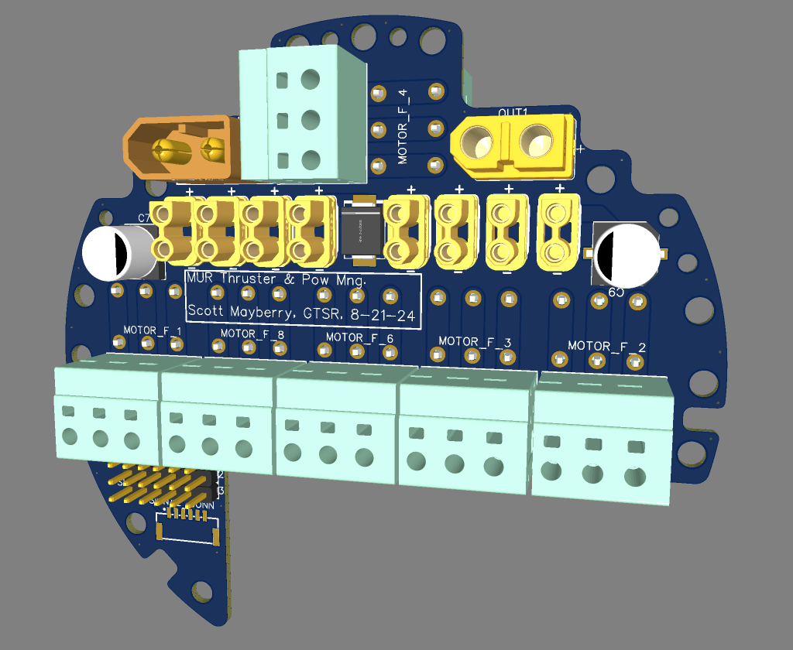
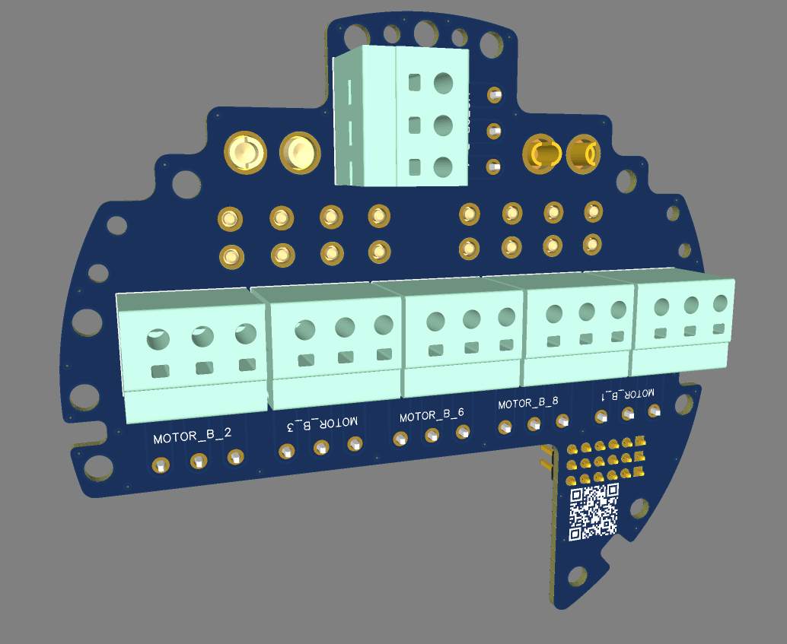

# ESC to Thruster Control PCB

This board handles ESC power and thruster connections to the external thrusters. There is also available power out with XT60 connectors. Further, there are 8 XT30 connectors for the ESCs.

  
  

