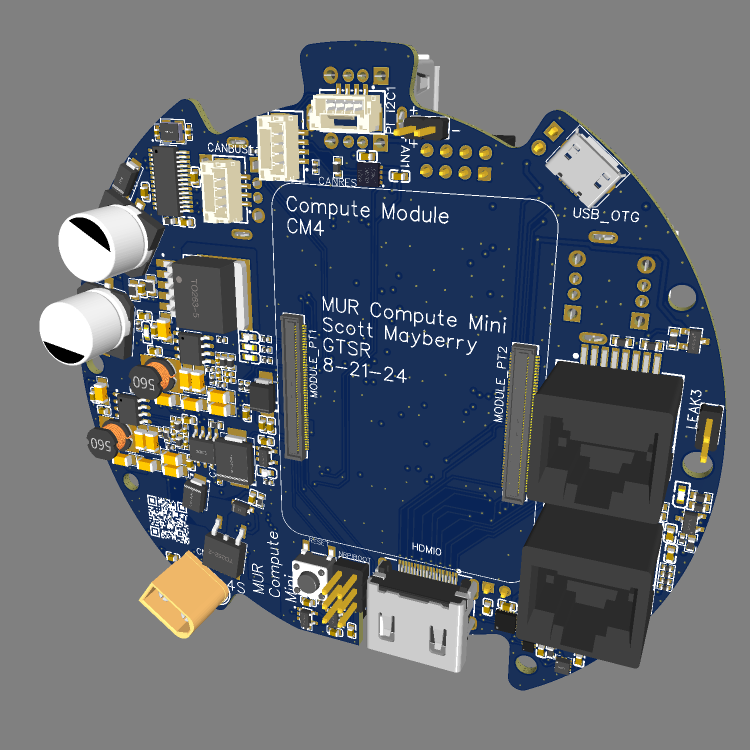
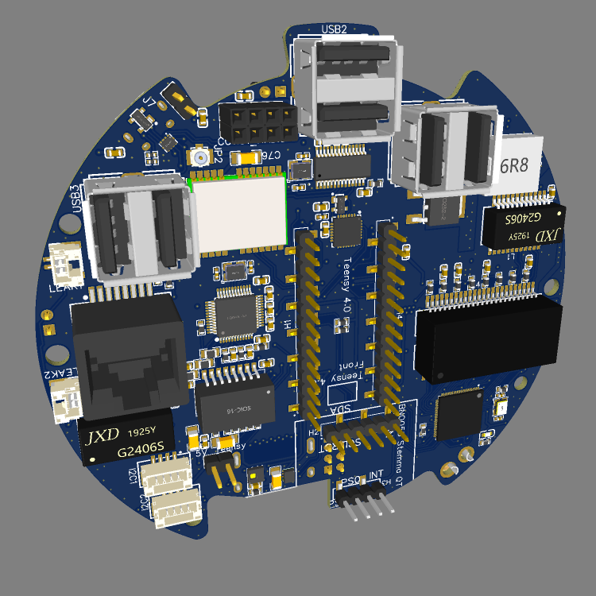

# MUR Compute Module Mini

  
  

This README describes the sensor components, communication features, and other key aspects integrated into the MUR Control and Communication PCB. These components are essential for monitoring and controlling the environmental conditions, orientation, movement, and communication of the Miniature Underwater Robot (MUR).

## Table of Contents

- [MUR Compute Module Mini](#mur-compute-module-mini)
  - [Table of Contents](#table-of-contents)
  - [Overview](#overview)
  - [Sensors Included on the PCB](#sensors-included-on-the-pcb)
    - [1. HSCDTD008A - Geomagnetic Sensor](#1-hscdtd008a---geomagnetic-sensor)
    - [2. LIS2MDLTR - Magnetometer](#2-lis2mdltr---magnetometer)
    - [3. KXTJ3-1057 - Accelerometer](#3-kxtj3-1057---accelerometer)
    - [4. LSM6DS3TR-C - IMU (6 DOF)](#4-lsm6ds3tr-c---imu-6-dof)
    - [5. MPU6500 - IMU (6 DOF)](#5-mpu6500---imu-6-dof)
    - [6. BNO055 (STEMMA QT Board) - IMU (9 DOF)](#6-bno055-stemma-qt-board---imu-9-dof)
    - [7. AHT20 - Temperature and Humidity Sensor](#7-aht20---temperature-and-humidity-sensor)
    - [8. DPS310 - Barometric Pressure Sensor](#8-dps310---barometric-pressure-sensor)
    - [9. ATGM332D-5N31 - GPS Module](#9-atgm332d-5n31---gps-module)
  - [I/O Section](#io-section)
    - [I2C Interfaces](#i2c-interfaces)
    - [Serial Interfaces](#serial-interfaces)
    - [CAN Bus](#can-bus)
    - [Leak Detection](#leak-detection)
    - [PWM Control](#pwm-control)
    - [USB Ports](#usb-ports)
    - [Fan Control](#fan-control)
  - [Communication Section](#communication-section)
    - [WiFi](#wifi)
    - [Ethernet](#ethernet)
    - [CC1101 Radio Slot](#cc1101-radio-slot)
  - [Power Section](#power-section)
    - [Power Input/Output](#power-inputoutput)
  - [Functionality and Applications](#functionality-and-applications)
    - [Key Functions:](#key-functions)
  - [Conclusion](#conclusion)

## Overview

The MUR Control and Communication PCB is equipped with various sensors, communication interfaces, and control ports that enable the robot to interact with its environment. These components provide essential data for tasks such as navigation, orientation, environmental monitoring, and communication, ensuring reliable operation and control of the MUR.

## Sensors Included on the PCB

### 1. [HSCDTD008A - Geomagnetic Sensor](https://www.mouser.com/datasheet/2/15/hscdtd008a_data-2885877.pdf)
   - **Manufacturer**: ALPSALPINE
   - **Description**: HSCDTD series is three-axis terrestrial magnetism sensor with digital output. It can be used to determine the robot's orientation relative to the Earth's magnetic field, similar to a compass.

### 2. [LIS2MDLTR - Magnetometer](https://www.mouser.co.uk/datasheet/2/389/lis2mdl-1849648.pdf)
   - **Manufacturer**: STMicroelectronics
   - **Description**: The LIS2MDLTR is a 3-axis magnetometer that measures the magnetic field intensity. It can be used to determine the robot's orientation relative to the Earth's magnetic field, similar to a compass.

### 3. [KXTJ3-1057 - Accelerometer](https://fscdn.rohm.com/kionix/en/datasheet/kxtj3-1057-e.pdf)
   - **Manufacturer**: ROHM Semiconductor
   - **Description**: This 3-axis accelerometer measures acceleration forces.

### 4. [LSM6DS3TR-C - IMU (6 DOF)](https://www.mouser.com/datasheet/2/389/lsm6ds3tr_c-1761429.pdf)
   - **Manufacturer**: STMicroelectronics
   - **Description**: This sensor combines a 3-axis gyroscope and a 3-axis accelerometer, providing comprehensive data for tracking the robot's orientation and movement in 3D space.

### 5. [MPU6500 - IMU (6 DOF)](https://product.tdk.com/system/files/dam/doc/product/sensor/mortion-inertial/imu/data_sheet/mpu-6500-datasheet2.pdf)
   - **Manufacturer**: InvenSense
   - **Description**: Similar to the LSM6DS3TR-C, the MPU6500 is another IMU that offers 6-axis motion tracking by combining a gyroscope and accelerometer.

### 6. [BNO055 (STEMMA QT Board) - IMU (9 DOF)](https://www.adafruit.com/product/4646)
   - **Manufacturer**: Bosch Sensortec (Adafruit for STEMMA QT version)
   - **Description**: The BNO055 is a 9-axis absolute orientation sensor that combines a 3-axis accelerometer, 3-axis gyroscope, and 3-axis magnetometer. The STEMMA QT version simplifies integration with the PCB, offering plug-and-play functionality. It provides orientation data that is essential for the MUR's precise movement and navigation.

### 7. [AHT20 - Temperature and Humidity Sensor](https://www.lcsc.com/datasheet/lcsc_datasheet_2310231158_Aosong--Guangzhou-Elec-AHT20_C2757850.pdf)
   - **Manufacturer**: Guangzhou Aosong Electronics
   - **Description**: The AHT20 sensor provides measurements of both temperature and humidity, which are vital for environmental monitoring within the robot's operational space.

### 8. [DPS310 - Barometric Pressure Sensor](https://www.lcsc.com/datasheet/lcsc_datasheet_1811071024_Infineon-Technologies-DPS310_C130156.pdf)
   - **Manufacturer**: Infineon
   - **Description**: The DPS310 measures barometric pressure and is typically used for altitude detection. In the context of the MUR, it can be used to monitor depth changes or detect subtle pressure variations in the underwater environment.

### 9. [ATGM332D-5N31 - GPS Module](https://www.lcsc.com/datasheet/lcsc_datasheet_2304140030_ZHONGKEWEI-ATGM332D-5N31_C128659.pdf)
   - **Manufacturer**: ZHONGKEWEI
   - **Description**: The ATGM332D-5N31 is a GPS module that provides geolocation data. This is crucial for navigation and positioning, allowing the MUR to determine its precise location in outdoor environments.

## I/O Section

The I/O section of the MUR Control and Communication PCB offers a variety of connectivity options, supporting both standard and specialized interfaces. This section provides extensive connectivity for sensors, actuators, communication modules, and power management, ensuring that the MUR can be easily integrated into complex systems.

### I2C Interfaces
   - **1 I2C Port for Compute Module CM4**: Dedicated I2C port for communication with the Raspberry Pi Compute Module 4.
   - **2 I2C Ports for Teensy 4.0**: These ports are used for connecting additional sensors or peripherals to the Teensy 4.0 microcontroller, enabling flexible expansion of the system’s sensing capabilities.

### Serial Interfaces
   - **USB_OTG Port for Flashing CM4**: A USB On-The-Go (OTG) port is provided for flashing the Raspberry Pi Compute Module 4, simplifying software updates and debugging.

### CAN Bus
   - **2 CAN Bus Interfaces**: These are used for reliable communication with other electronic control units (ECUs) in the robot, such as motor controllers and other high-reliability systems.

### Leak Detection
   - **3 Leak Sensors**: Two JST connectors and one pin header are provided for attaching leak sensors. These are critical for detecting water ingress and protecting the robot's electronics during underwater operations.

### PWM Control
   - **Not Applicable**: This version of the PCB does not include PWM control features.

### USB Ports
   - **6 USB 2.0 Hub**: This hub provides connectivity for USB devices, enabling the connection of peripherals such as cameras, additional sensors, or communication modules.

### Fan Control
   - **5V Fan Port**: A dedicated port for controlling a 5V fan, used to manage the temperature of the Raspberry Pi Compute Module 4 and other components.

## Communication Section

### WiFi
   - The CM4 module has built-in WiFi.

### Ethernet
   - **Ethernet Switch with 3 Ports**: An integrated Ethernet switch provides three available ports, allowing the MUR to connect to multiple external devices or networks simultaneously. This is crucial for ensuring stable and flexible wired communication with controllers, data acquisition systems, or other networked devices.

### CC1101 Radio Slot
   - **CC1101 Radio Module Slot**: This slot accommodates a CC1101 radio module, which provides low-power RF communication capabilities. The CC1101 module is commonly used for wireless communication in the sub-1 GHz frequency range, making it ideal for remote control and data transmission over longer distances, even in underwater environments.

## Power Section

### Power Input/Output
   - **XT60 Inputs**: The XT60 connectors serve as the primary power input for the board. These connectors are rated for high current, ensuring stable power delivery to all connected systems and components.
   - **XT60 Outputs**: These connectors provide power outputs for other high-power devices or systems, such as motor controllers, that need to draw significant current.
   - **XT30 Outputs**: These outputs are used to power lower current subsystems and peripherals, providing flexibility in managing power distribution across different parts of the robot.

## Functionality and Applications

The sensors and I/O features on this PCB are integral to the MUR's ability to interact with its environment and ensure smooth and reliable operation. This board is designed to facilitate a range of tasks, from environmental sensing to navigation, communication, and power management.

### Key Functions:

- **Navigation and Orientation**: IMUs such as the MPU6500, LSM6DS3TR-C, and BNO055, along with the magnetometer and GPS module, provide precise orientation and positioning data, enabling stable and accurate navigation.
- **Environmental Monitoring**: The board's sensors, including the HSCDTD008A, DPS310, and AHT20, allow the robot to gather important environmental data such as temperature, humidity, barometric pressure, and magnetic field strength. This data helps the MUR adapt to its surroundings, whether underwater or on the surface.
- **Communication**: The board's Ethernet switch, USB hub, and CC1101 radio module slot enable the MUR to communicate effectively with other devices, both wired and wirelessly. The USB OTG and the Ethernet passthrough further ease system updates and tethered operations.
- **Cooling and Stability**: With the 5V fan port, the MUR can ensure stable operation by keeping its components cool, especially during long-duration missions or in warmer environments.
- **Safety**: Leak detection sensors are crucial for protecting the robot's electronics during underwater operations, providing early warnings and mitigating potential damage from water ingress.

## Conclusion

The MUR Control and Communication PCB is a comprehensive platform that integrates advanced sensing, communication, and power management capabilities. These features ensure that the MUR can navigate, monitor its environment, and respond to dynamic conditions effectively, while also allowing for seamless integration with external systems. Whether operating autonomously or controlled remotely, this board ensures that the MUR is equipped for reliable performance in a variety of challenging environments.