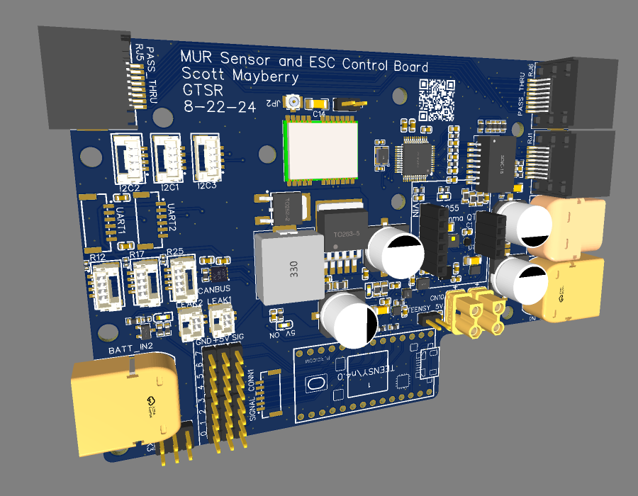
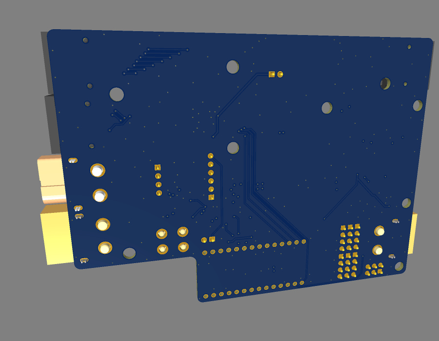

# MUR Sensor and ESC Control PCB

  
  

This README describes the sensor components and other key features integrated into the MUR Sensor and ESC (Electronic Speed Controller) Control PCB. These components are crucial for monitoring and controlling the environmental conditions, orientation, movement, and communication of the Miniature Underwater Robot (MUR).

## Table of Contents

- [MUR Sensor and ESC Control PCB](#mur-sensor-and-esc-control-pcb)
  - [Table of Contents](#table-of-contents)
  - [Overview](#overview)
  - [Sensors Included on the PCB](#sensors-included-on-the-pcb)
    - [1. HSCDTD008A - Geomagnetic Sensor](#1-hscdtd008a---geomagnetic-sensor)
    - [2. LIS2MDLTR - Magnetometer](#2-lis2mdltr---magnetometer)
    - [3. KXTJ3-1057 - Accelerometer](#3-kxtj3-1057---accelerometer)
    - [4. LSM6DS3TR-C - IMU (6 DOF)](#4-lsm6ds3tr-c---imu-6-dof)
    - [5. MPU6500 - IMU (6 DOF)](#5-mpu6500---imu-6-dof)
    - [6. BNO055 (STEMMA QT Board) - IMU (9 DOF)](#6-bno055-stemma-qt-board---imu-9-dof)
    - [7. AHT20 - Temperature and Humidity Sensor](#7-aht20---temperature-and-humidity-sensor)
    - [8. DPS310 - Barometric Pressure Sensor](#8-dps310---barometric-pressure-sensor)
    - [9. ATGM332D-5N31 - GPS Module](#9-atgm332d-5n31---gps-module)
  - [I/O Section](#io-section)
    - [I2C Interfaces](#i2c-interfaces)
    - [Serial Interfaces](#serial-interfaces)
    - [CAN Bus](#can-bus)
    - [Leak Detection](#leak-detection)
    - [PWM Control](#pwm-control)
  - [Communication Section](#communication-section)
    - [Ethernet](#ethernet)
  - [Power Section](#power-section)
    - [Power Input/Output](#power-inputoutput)
  - [Functionality and Applications](#functionality-and-applications)
  - [Conclusion](#conclusion)

## Overview

The MUR Sensor and ESC Control PCB is equipped with various sensors and interfaces that enable the robot to detect and respond to its environment. These components provide essential data for tasks such as navigation, orientation, environmental monitoring, and control of the robot's actuators.

## Sensors Included on the PCB

### 1. [HSCDTD008A - Geomagnetic Sensor](https://www.mouser.com/datasheet/2/15/hscdtd008a_data-2885877.pdf)
   - **Manufacturer**: ALPSALPINE
   - **Description**: HSCDTD series is three axis terrestrial magnetism sensor with digital output. It can be used to determine the robot's orientation relative to the Earth's magnetic field, similar to a compass.

### 2. [LIS2MDLTR - Magnetometer](https://www.mouser.co.uk/datasheet/2/389/lis2mdl-1849648.pdf)
   - **Manufacturer**: STMicroelectronics
   - **Description**: The LIS2MDLTR is a 3-axis magnetometer that measures the magnetic field intensity. It can be used to determine the robot's orientation relative to the Earth's magnetic field, similar to a compass.

### 3. [KXTJ3-1057 - Accelerometer](https://fscdn.rohm.com/kionix/en/datasheet/kxtj3-1057-e.pdf)
   - **Manufacturer**: ROHM Semiconductor
   - **Description**: This 3-axis accelerometer measures acceleration forces.

### 4. [LSM6DS3TR-C - IMU (6 DOF)](https://www.mouser.com/datasheet/2/389/lsm6ds3tr_c-1761429.pdf)
   - **Manufacturer**: STMicroelectronics
   - **Description**: This sensor combines a 3-axis gyroscope and a 3-axis accelerometer, providing comprehensive data for tracking the robot's orientation and movement in 3D space.

### 5. [MPU6500 - IMU (6 DOF)](https://product.tdk.com/system/files/dam/doc/product/sensor/mortion-inertial/imu/data_sheet/mpu-6500-datasheet2.pdf)
   - **Manufacturer**: InvenSense
   - **Description**: Similar to the LSM6DS3TR-C, the MPU6500 is another IMU that offers 6-axis motion tracking by combining a gyroscope and accelerometer.

### 6. [BNO055 (STEMMA QT Board) - IMU (9 DOF)](https://www.adafruit.com/product/4646)
   - **Manufacturer**: Bosch Sensortec (Adafruit for STEMMA QT version)
   - **Description**: The BNO055 is a 9-axis absolute orientation sensor that combines a 3-axis accelerometer, 3-axis gyroscope, and 3-axis magnetometer. The STEMMA QT version simplifies integration with the PCB, offering plug-and-play functionality. It provides orientation data that is essential for the MUR's precise movement and navigation.

### 7. [AHT20 - Temperature and Humidity Sensor](https://www.lcsc.com/datasheet/lcsc_datasheet_2310231158_Aosong--Guangzhou-Elec-AHT20_C2757850.pdf)
   - **Manufacturer**: Guangzhou Aosong Electronics
   - **Description**: The AHT20 sensor provides measurements of both temperature and humidity, which are vital for environmental monitoring within the robot's operational space.

### 8. [DPS310 - Barometric Pressure Sensor](https://www.lcsc.com/datasheet/lcsc_datasheet_1811071024_Infineon-Technologies-DPS310_C130156.pdf)
   - **Manufacturer**: Infineon
   - **Description**: The DPS310 measures barometric pressure and is typically used for altitude detection. In the context of the MUR, it can be used to monitor depth changes or detect subtle pressure variations in the underwater environment.

### 9. [ATGM332D-5N31 - GPS Module](https://www.lcsc.com/datasheet/lcsc_datasheet_2304140030_ZHONGKEWEI-ATGM332D-5N31_C128659.pdf)
   - **Manufacturer**: ZHONGKEWEI
   - **Description**: The ATGM332D-5N31 is a GPS module that provides geolocation data. This is crucial for navigation and positioning, allowing the MUR to determine its precise location in outdoor environments.

## I/O Section

The I/O section of the MUR Sensor and ESC Control PCB is designed to provide extensive connectivity options that adhere to the PixHawk standard, ensuring compatibility with a wide range of existing components and systems used in robotics and UAVs. This section includes multiple interfaces for I2C, serial communication, CAN bus, PWM control, and leak detection, allowing for flexible and robust integration of sensors, actuators, and other peripherals essential for the MUR's operation.

### I2C Interfaces
   - **3 I2C Ports**: These are available for connecting additional sensors or peripherals that communicate using the I2C protocol. This provides flexibility in expanding the MUR's sensing capabilities.

### Serial Interfaces
   - **2 Serial Ports**: Available for connecting serial devices, such as communication modules or additional controllers, allowing for straightforward integration of various serial peripherals.

### CAN Bus
   - **3 CAN Bus Interfaces**: These are used for robust communication with other electronic control units (ECUs) in the robot. CAN Bus is essential for transmitting data between high-reliability systems, such as motor controllers.

### Leak Detection
   - **2 Leak Sensor JST Connectors**: These connectors are dedicated to attaching leak sensors that can detect water ingress, a critical feature for underwater operations.
   - **3 Leak Detector Header Pins**: Additional pins are provided for flexibility in connecting multiple leak detectors.

### PWM Control
   - **8 PWM Pins for Servo Control**: These pins are used to control servos or other PWM-driven actuators, providing precise control over the robot's mechanical movements.
   - **1 Additional PWM Pin for Batch Control**: This pin can control pins 0-5 of the same 8 PWM pins but is provided as a JST connector for ease of use, enabling grouped control of multiple actuators.

## Communication Section

### Ethernet
   - **W5500 Chip**: This Ethernet controller chip provides wired network connectivity, allowing the MUR to interface with external networks or control systems.
   - **RJ45 Connector**: A standard RJ45 port is available for connecting the Ethernet cable, facilitating reliable communication over a wired network.
   - **RJ45 Passthrough**: A passthrough connector simplifies the connection of a tether into the system, making deployment and maintenance more straightforward.

## Power Section

### Power Input/Output
   - **XT60 Inputs**: Provides the primary power input for the PCB, capable of handling high current to power all the components on the board.
   - **XT60 Outputs**: These connectors allow power to be routed out to other high-power components or subsystems, such as motor controllers.
   - **XT30 Outputs**: Additional outputs for supplying power to lower power components or systems, offering flexibility in power distribution across the robot.

## Functionality and Applications

The sensors and I/O features on this PCB are integral to the MUR's ability to interact with its environment. They provide data and control interfaces essential for:

- **Navigation and Orientation**: Using IMUs (MPU6500, LSM6DS3TR-C, BNO055), the magnetometer (LIS2MDLTR), and the GPS module (ATGM332D-5N31), the robot can maintain stable movement and orientation, even in challenging underwater conditions. The GPS module provides essential positioning data for surface-level navigation.
- **Environmental Monitoring**: Sensors like the HSCDTD008A, DPS310, and AHT20 allow the robot to monitor environmental conditions such as pressure, depth, temperature, and humidity, ensuring optimal operation and safety.
- **Movement Control**: The PWM pins provide control over the robot’s servos and other actuators, allowing for precise mechanical movement and operation.
- **Communication**: The Ethernet and CAN bus interfaces enable reliable communication with external systems, whether for control, data transmission, or network integration.
- **Safety**: The leak detection system is vital for underwater operation, providing an early warning system for potential water ingress, thus protecting the robot's electronics.

## Conclusion

The MUR Sensor and ESC Control PCB is a comprehensive solution that combines advanced sensing capabilities with robust communication and power management. These features ensure that the MUR can navigate, monitor its environment, and respond to dynamic conditions effectively, while also allowing for easy integration and control through various interfaces.